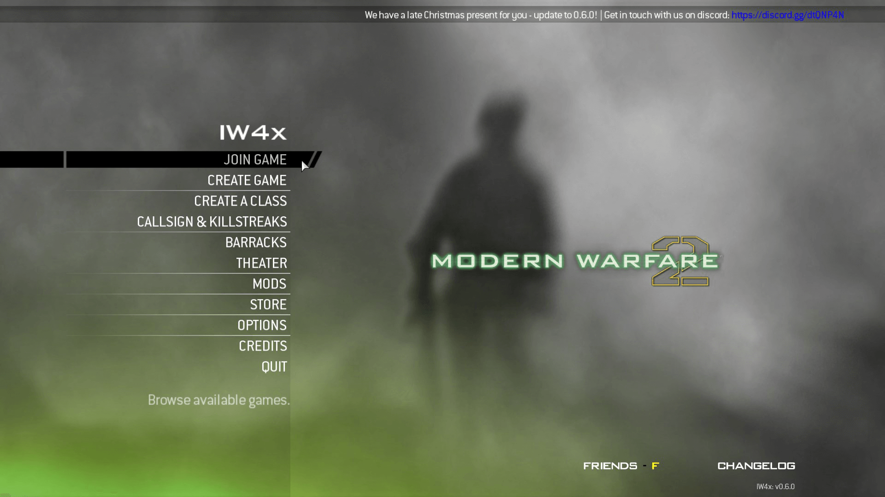
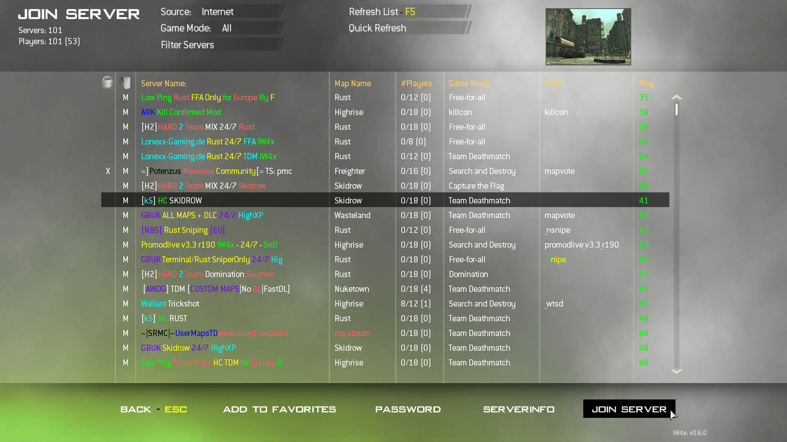
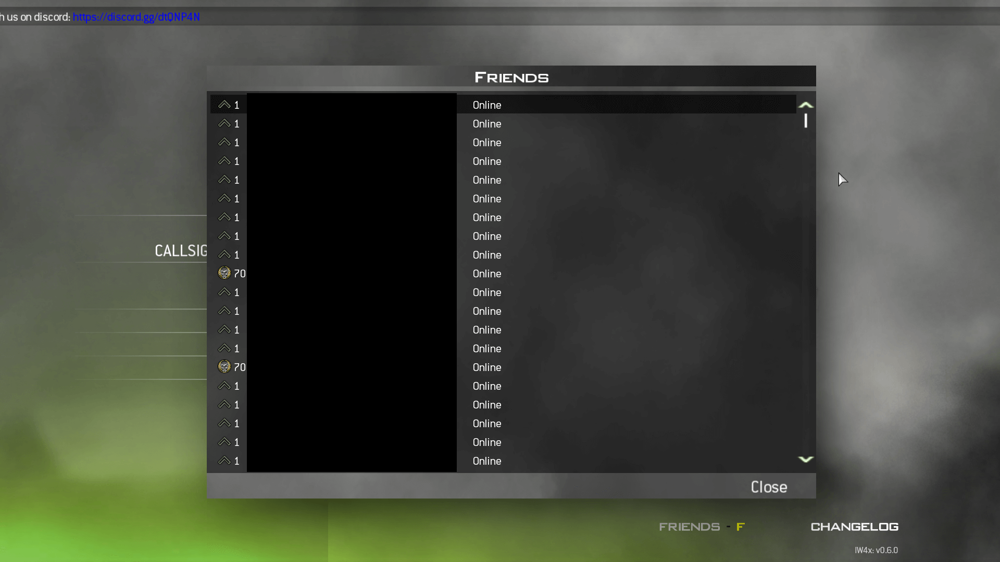
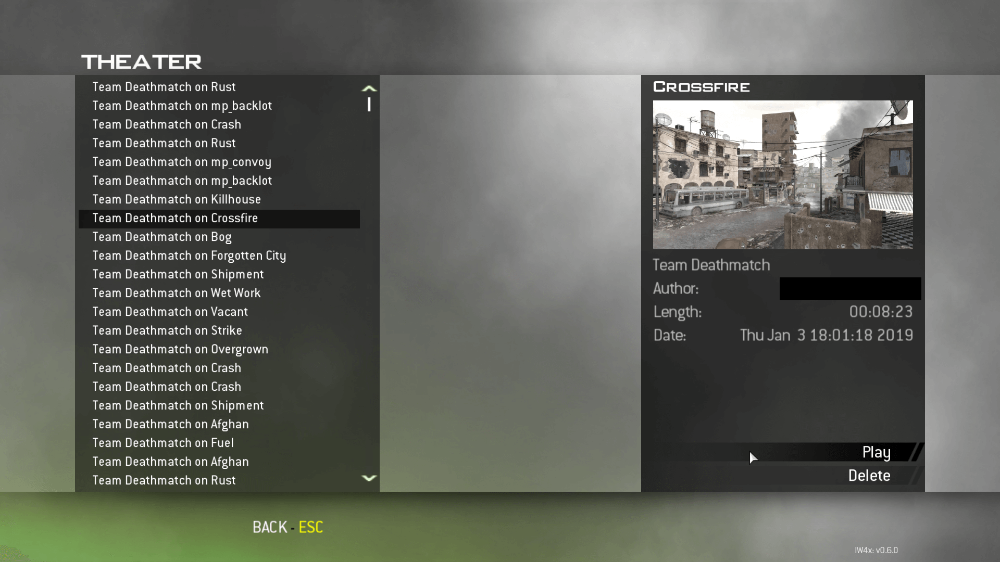

<h1 align="center">
     
    
     
</h1>

- **IW4x** es un proyecto para poder jugar al **Call of Duty: Modern Warfare 2** (con el nombre en clave (oficial) de **IW4**).
- Cuenta con las siguientes **Características principales**:
    - Reescrito desde cero
    - Backend descentralizado
    - Servidores dedicados (Party y Match)
    - Soporte para Mods, incluye un zonebuilder integrado para construir tus propios Fast Files (por ejemplo, un mod.ff)
    - Interfaz de usuario mejorada
    - Modo teatro
    - Soporte para inclinación (mecánica vista en en entregas anteriores, donde con la Q y E te puedes inclinar)
    - Modo LAN Offline
    - Y mucho más....

## Aviso
- Este repositorio no contiene ningún código de IW4x, tan solo proporciona soporte y ayuda a los usuarios de habla hispana.
  - Puedes encontrar el código de IW4x en [su repositorio](https://github.com/IW4x/iw4x-client).
- Este repositorio se basa en el de [Jawesome99](https://github.com/Jawesome99/IW4x) y en el [Nuevo Sitio de IW4x](#enlaces-de-iw4x).
  - Si necesitas ir al repositorio de Jawesome99 o al nuevo sitio de IW4x, pero no sabes Inglés, puedes usar [DeepL](https://www.deepl.com/translator) como Traductor de Inglés a Español.

## :wave: Mi Retiro
- Ya no haré más nada en mi Repositorio / Wiki, ni tampoco daré soporte alguno.
- Si quieres continuar con lo que empecé, puedes hacerle un **Fork** a mi Repositorio y Wiki.
  - Obviamente puedes traducir todo a otro idioma y continuar desde ahí.
    - Tan solo no olvides de agregarme a los créditos.

## Tabla de Contenidos
- [Inicio](../../wiki)
  - [Características principales](../../wiki#caracter%C3%ADsticas-principales)
  - [Guía de instalación de IW4x](../../wiki#gu%C3%ADa-de-instalaci%C3%B3n-de-iw4x)
  - [Pedir ayuda](../../wiki#pedir-ayuda)
  - [Lista de Cambios](../../wiki#lista-de-cambios)
- [General](../../wiki/General)
  - [Estructura de carpetas](../../wiki/General#estructura-de-carpetas)
- [Cliente](../../wiki/Cliente)
  - [Instalación](../../wiki/Cliente#instalaci%C3%B3n)
  - [Parámetros de línea de comandos](../../wiki/Cliente#par%C3%A1metros-de-l%C3%ADnea-de-comandos)
  - [Código de Colores](../../wiki/Cliente#c%C3%B3digo-de-colores)
  - [Direct3D 9Ex](../../wiki/Cliente#direct3d-9ex)
  - [Cursor nativo](../../wiki/Cliente#cursor-nativo)
  - [Niveles de seguridad](../../wiki/Cliente#niveles-de-seguridad)
- [Servidor](../../wiki/Servidor)
  - [Tipos de Servidor](../../wiki/Servidor#tipos-de-servidor)
    - [Party](../../wiki/Servidor#party)
    - [Match](../../wiki/Servidor#match)
  - [Requisitos](../../wiki/Servidor#requisitos)
  - [Instrucciones rápidas para alojar un servidor Party](../../wiki/Servidor#instrucciones-r%C3%A1pidas-para-alojar-un-servidor-party)
  - [Instrucciones rápidas para alojar un servidor Match](../../wiki/Servidor#instrucciones-r%C3%A1pidas-para-alojar-un-servidor-match)
- [Optimizar IW4x](../../wiki/Optimizar-IW4x)
  - [Cliente](../../wiki/Optimizar-IW4x#cliente)
  - [Servidor](../../wiki/Optimizar-IW4x#servidor)
- [Preguntas frecuentes](../../wiki/Preguntas-frecuentes)
  - [¿Donde puedo descargar la última versión de IW4x?](../../wiki/Preguntas-frecuentes#donde-puedo-descargar-la-última-versión-de-iw4x)
  - [¿Donde puedo descargar CoD: MW 2?](../../wiki/Preguntas-frecuentes#donde-puedo-descargar-cod-mw-2)
  - [¿Donde puedo descargar los DLC?](../../wiki/Preguntas-frecuentes#donde-puedo-descargar-los-dlc)
  - [¿Qué idiomas puedo usar?](../../wiki/Preguntas-frecuentes#qué-idiomas-puedo-usar)
  - [¿Cómo puedo reparar/verificar mis archivos de juego?](../../wiki/Preguntas-frecuentes#cómo-puedo-repararverificar-mis-archivos-de-juego)
  - [¿Puedo jugar al Modo Campaña / Operaciones Especiales con IW4x?](../../wiki/Preguntas-frecuentes#puedo-jugar-al-modo-campaña--operaciones-especiales-con-iw4x)
  - [¿Cómo puedo abrir y usar la consola?](../../wiki/Preguntas-frecuentes#cómo-puedo-abrir-y-usar-la-consola)
  - [¿Puedo usar IW4x en la misma carpeta que mi juego de Steam?](../../wiki/Preguntas-frecuentes#puedo-usar-iw4x-en-la-misma-carpeta-que-mi-juego-de-steam)
  - [¿Puedo tener un VAC / Game Ban en Steam por usar IW4x?](../../wiki/Preguntas-frecuentes#puedo-tener-un-vac--game-ban-en-steam-por-usar-iw4x)
  - [¿Puedo jugar en IW4x con jugadores de Steam o viceversa?](../../wiki/Preguntas-frecuentes#puedo-jugar-en-iw4x-con-jugadores-de-steam-o-viceversa)
  - [¿IW4x está plagado de tramposos?](../../wiki/Preguntas-frecuentes#iw4x-está-plagado-de-tramposos)
  - [¿Puedo mover mis estadísticas de Steam a IW4x o viceversa?](../../wiki/Preguntas-frecuentes#puedo-mover-mis-estadísticas-de-steam-a-iw4x-o-viceversa)
  - [¿Cómo puedo desbloquear todo en IW4x?](../../wiki/Preguntas-frecuentes#cómo-puedo-desbloquear-todo-en-iw4x)
  - [¿Puedo escribir en mi Título?](../../wiki/Preguntas-frecuentes#puedo-escribir-en-mi-título)
  - [¿Cómo cambio mi sensibilidad?](../../wiki/Preguntas-frecuentes#cómo-cambio-mi-sensibilidad)
  - [¿Cómo puedo cambiar mi FOV (Campo de Visión)?](../../wiki/Preguntas-frecuentes#cómo-puedo-cambiar-mi-fov-campo-de-visión)
  - [¿Cómo puedo usar comandos protegidos en una Partida Privada?](../../wiki/Preguntas-frecuentes#cómo-puedo-usar-comandos-protegidos-en-una-partida-privada)
  - [¿Cómo puedo jugar contra BOTS?](../../wiki/Preguntas-frecuentes#cómo-puedo-jugar-contra-bots)
  - [¿Cómo puedo instalar mods?](../../wiki/Preguntas-frecuentes#cómo-puedo-instalar-mods)
  - [¿Dónde puedo descargar mods?](../../wiki/Preguntas-frecuentes#dónde-puedo-descargar-mods)
  - [¿Qué es el nivel de seguridad y por qué estoy atascado en él?](../../wiki/Preguntas-frecuentes#qué-es-el-nivel-de-seguridad-y-por-qué-estoy-atascado-en-él)
  - [¿Cómo puedo reportar a los tramposos?](../../wiki/Preguntas-frecuentes#cómo-puedo-reportar-a-los-tramposos)
  - [¿Cuales son los Puertos por defecto?](../../wiki/Preguntas-frecuentes#cuales-son-los-puertos-por-defecto)
  - [¿Cómo puedo mejorar mis FPS?](../../wiki/Preguntas-frecuentes#cómo-puedo-mejorar-mis-fps)
  - [¿Por qué tengo FPS bajos en mi Laptop Gamer?](../../wiki/Preguntas-frecuentes#por-qué-tengo-fps-bajos-en-mi-laptop-gamer)
  - [¿Por qué veo menos servidores que otros en IW4X?](../../wiki/Preguntas-frecuentes#por-qué-veo-menos-servidores-que-otros-en-iw4x)
  - [¿Por qué no puedo grabar usando OBS, FRAPS, Dxtory, etc?](../../wiki/Preguntas-frecuentes#por-qué-no-puedo-grabar-usando-obs-fraps-dxtory-etc)
- [Solución de Problemas](../../wiki/Solución-de-Problemas)
  - [System Error: binkw32.dll was not found](../../wiki/Solución-de-Problemas#system-error-binkw32dll-was-not-found)
  - [System Error: mss32.dll was not found](../../wiki/Solución-de-Problemas#system-error-mss32dll-was-not-found)
  - [System Error: d3dx9_40.dll was not found](../../wiki/Solución-de-Problemas#system-error-d3dx9_40dll-was-not-found)
  - [Error during initialization: Couldn't load fileSysCheck.cfg](../../wiki/Solución-de-Problemas#error-during-initialization-couldnt-load-filesyscheckcfg)
  - [Couldn't load image 'XXX'](../../wiki/Solución-de-Problemas#couldnt-load-image-xxx)
  - [Entry Point Not Found - (DirectSound)](../../wiki/Solución-de-Problemas#entry-point-not-found---directsound)
  - [Zone Version XXX is not supported](../../wiki/Solución-de-Problemas#zone-version-xxx-is-not-supported)
  - [Fatal Error con Steam](../../wiki/Solución-de-Problemas#fatal-error-con-steam)
  - [Fatal Error en Servidor Dedicado](../../wiki/Solución-de-Problemas#fatal-error-en-servidor-dedicado)
  - [Fatal Error en Windows 7](../../wiki/Solución-de-Problemas#fatal-error-en-windows-7)
  - [Fatal Error 0xC0000005](../../wiki/Solución-de-Problemas#fatal-error-0xc0000005)
  - [Fatal Error 0xC000007b](../../wiki/Solución-de-Problemas#fatal-error-0xc000007b)
  - [Pantalla en Negro / No responde al iniciar el juego](../../wiki/Solución-de-Problemas#pantalla-en-negro--no-responde-al-iniciar-el-juego)
  - [Out of memory error](../../wiki/Solución-de-Problemas#out-of-memory-error)
  - [El juego se congeló y no puedo cerrarlo](../../wiki/Solución-de-Problemas#el-juego-se-congeló-y-no-puedo-cerrarlo)
  - [Baja cantidad de servidores](../../wiki/Solución-de-Problemas#baja-cantidad-de-servidores)
  - [No hay servidores](../../wiki/Solución-de-Problemas#no-hay-servidores)
  - [Incrementando el nivel de seguridad](../../wiki/Solución-de-Problemas#incrementando-el-nivel-de-seguridad)
  - [XUID doesn't match the certificate](../../wiki/Solución-de-Problemas#xuid-doesnt-match-the-certificate)
  - [Servidor desconectado](../../wiki/Solución-de-Problemas#servidor-desconectado)
  - [El servidor es sólo para jugadores con ping bajo](../../wiki/Solución-de-Problemas#el-servidor-es-sólo-para-jugadores-con-ping-bajo)
  - [Failed to download Mod List](../../wiki/Solución-de-Problemas#failed-to-download-mod-list)
  - [Awaiting gamestate](../../wiki/Solución-de-Problemas#awaiting-gamestate)
  - [Si se ejecuta un Mod, sea cual sea, tengo 10-40 FPS!](../../wiki/Solución-de-Problemas#si-se-ejecuta-un-mod-sea-cual-sea-tengo-10-40-fps)
  - [Bajones de FPS, fotogramas entrecortados y ghosting](../../wiki/Solución-de-Problemas#bajones-de-fps-fotogramas-entrecortados-y-ghosting)
  - [No aparece el Punto de Mira / Crosshair](../../wiki/Solución-de-Problemas#no-aparece-el-punto-de-mira--crosshair)
  - [No aparece el Radar / Minimapa](../../wiki/Solución-de-Problemas#no-aparece-el-radar--minimapa)
  - [El menú no responde / pantalla negra con música al desconectarme](../../wiki/Solución-de-Problemas#el-menú-no-responde--pantalla-negra-con-música-al-desconectarme)
  - [Mi Mando no funciona en IW4x](../../wiki/Solución-de-Problemas#mi-mando-no-funciona-en-iw4x)
  - [No se desbloquean los Desafíos](../../wiki/Solución-de-Problemas#no-se-desbloquean-los-desafíos)
  - [Muchas horas jugadas en Steam](../../wiki/Solución-de-Problemas#muchas-horas-jugadas-en-steam)
  - [Conexión con el host perdida cuando veo una Demo](../../wiki/Solución-de-Problemas#conexión-con-el-host-perdida-cuando-veo-una-demo)
  - [Servidor Party: Waiting for public key for minidump upload address.](../../wiki/Solución-de-Problemas#servidor-party-waiting-for-public-key-for-minidump-upload-address)
- [Enlaces de IW4x](#enlaces-de-iw4x)
- [Enlaces importantes de CoD: MW 2](#enlaces-importantes-de-cod-mw-2)
- [Multimedia](#multimedia)

## Enlaces de IW4x
**[`^        VOLVER ARRIBA        ^`](#tabla-de-contenidos)**
- [IW4x's Repo](https://github.com/IW4x/iw4x-client) - Repositorio oficial de IW4x.
- [IW4x's New Website](https://iw4x.org/) - Nuevo sitio de IW4x, arriba a la derecha podrás seleccionar el Idioma.
- [IW4x's Old Website](http://iw4xcachep26muba.onion/) - El viejo sitio de IW4x (Requiere [Tor](https://www.torproject.org/)).
  - No requiere Tor: [.onion.link](https://iw4xcachep26muba.onion.link), [.onion.ly](https://iw4xcachep26muba.onion.ly), [.onion.pet](https://iw4xcachep26muba.onion.pet), [.onion.sh](https://iw4xcachep26muba.onion.sh) o [.onion.ws](https://iw4xcachep26muba.onion.ws)
- [IW4x's Tumblr](https://iw4x.tumblr.com/) - Tumblr de IW4x, que puede contener algunas guías.
- [IW4x's Discord](https://discord.gg/sKeVmR3) - Discord de IW4x.
- [IW4x's Wiki](../../../wiki) - Wiki no oficial (en español) de IW4x, donde encontrarás (casi) todo lo que necesitas.

## Enlaces importantes de CoD: MW 2
**[`^        VOLVER ARRIBA        ^`](#tabla-de-contenidos)**
- [Manual](https://store.steampowered.com/manual/10180/)
- [Discusiones](https://steamcommunity.com/app/10180/discussions/) ([MP](https://steamcommunity.com/app/10190/discussions/))
- [Guías](https://steamcommunity.com/app/10180/guides/) ([MP](https://steamcommunity.com/app/10190/guides/))
- [PCGamingWiki](https://pcgamingwiki.com/wiki/Call_of_Duty:_Modern_Warfare_2)

## Multimedia
**[`^        VOLVER ARRIBA        ^`](#tabla-de-contenidos)**

| **Vídeos** | **Vídeos** |
|:----------:|:----------:|
| 
 Primer mapa personalizado | 
 Mod Tools |
| **Imágenes** | **Imágenes** |
| 
 Menú Principal | 
 Lista de Servidores |
| 
  Lista de Amigos | 
  Modo Teatro |
